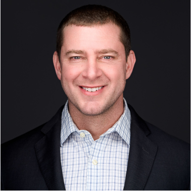

## Workshop Description
This content serves as a companion lab guide, supplementing Mission IT and Claroty's two-day hands-on Claroty CTD workshop.

This content is meant to expose attendees to operationalizing Claroty CTD on an air-gapped/disconnected Government network, and includes topics such as:
* Learning deployment models for Claroty CTD
* How to perform asset inventory and discovery, using both passive and active techniques
* Performing vulnerability analysis of devices on the network
* How to triage any events or alerts
* Performing active threat hunting on the OT network

## Instructor Bios
This workshop is typically delivered through Mission IT and Claroty technical instructors. 

### Mission IT

| Instructor | Bio | Contact |
|------------|-----|---------|
| 
Cassidy Alcorn    
 | 
Cassidy has deployed Claroty CTD to onsite military networks, ranging from missile interception/defense sites to facility-related control systems for the U.S. Intelligence Community.

Additionally, Cassidy is a co-author of the [U.S. Government Configuration Baseline for Claroty CTD](https://ncp.nist.gov/checklist/1331), published in the NIST National Checklist program.
 | [cassidy@missionit.com](mailto:cassidy@missionit.com)|
| 
Ryan Thorn    
  | 
Ryan brings 20 years of systems engineering experience, with a background in U.S. Intelligence and Defense systems.
  | [ryan@missionit.com](mailto:ryan@missionit.com)   703-728-3822 |
| 
Shawn Wells    
 | 
Shawn has fielded production deployments of Claroty to sites such as missile defense, nuclear launch and detection facilities, U.S. Intelligence Community facility-related control systems, water/wastewater systems, fuel storage and processing, and other Defense-focused ICS and SCADA facilities.

Shawn's role in developing OT-specific cyber weapons during his time as an NSA civilian was recently declassified through the [Dawn of Cyberwarfare](https://www.youtube.com/watch?v=BIEOB2jIr_o) documentary.

Joined with Cassidy Alcorn, Shawn is a co-author of the U.S. Government Configuration Baseline for Claroty CTD.
   | [shawn@missionit.com](mailto:shawn@missionit.com)   443-534-0130 |

### Claroty

| Instructor | Bio | Contact |
|------------|-----|---------|
| 
Randy Benn    
  | 
Randy began his career as a Communications and Computer Systems Officer in the U.S. Air Force. Later at Cisco, he spent over 26 years as an instructor, collaboration specialist, and IoT Solution Architect supporting U.S. Federal agencies. In his current role at Claroty, Randy is an OT Security Solution Engineer supporting the U.S. Federal sales team.

Randy enjoys volunteering as an industry mentor for high school and college students competing in cyber competitions, including [Cyber Patriot](https://www.uscyberpatriot.org) and [National Cyber League](https://nationalcyberleague.org).

He holds a Bachelor of Science in Math and Computer Science from Bloomsburg University and a Master of Business Administration from Old Dominion University.
 | randy.b@clarotygov.us   703-599-1419|