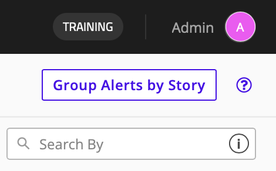

## SCENARIO / CONTEXT

Alerts are generated when Claroty determines that an activity is significant enough to require attention. Alerts provide context and information that can help determine whether activity is expected, suspicious, or potentially malicious.

We now want to gain an understanding of how Claroty presents suspicious activity and how stories are formed from groups of indvidual alerts. We also want to understand what information is available within an alert, how alerts are prioritized, and how they can be used to begin an investigation into an asset, communication path, or broader network activity.

---
## TASK 1: Alert Information
* Navigate to `Threat Detection` > `Alerts`.
  
* Review the **Alerts** page.
    - Alerts can be filtered by type, status, category, etc., 
    - Each has its own status, and the ability to be assigned to a specific user.
  

* There are two types of alerts:

| Alert | Description |
|:-|:-|
| **Security Event Alerts** | Indicate potentially malicious or suspicious activity. Examples include: - Port Scanning - Unauthorized Communications - Exploit Attempts |
| **Process Integrity Alerts** | Indicate changes to operational processes. Examples include: - Configuration Changes - Firmware Updates - Logic Changes |

* In the **Alerts** search bar, search for `Heap Spray` and select one of the two **ETERNALBLUE** alerts to open its **Alert View** page.
    - The top banner will display the type of alert (such as *Known Threat*, *Network Scan*, *Configuration Download*, etc.) followed by a short description of it. The page also includes additional and useful information:

| Module | Description |
|:-|:-|
| **Network Signature Info** | Provides basic information about the alert, including its signature ID and name. |
| **Alert Score** | Includes *Significant Indicators* and how Claroty calculated the score. |
| **Root Cause Analysis** | Shows a series of related alerts, also known as a <u>Story</u>, and an asset communication map. |
| **Mitigation Steps** | Suggests potential mitigation steps, dependant on the type and criticality of the alert. |
| **Alert** | Provides information about the asset(s) that triggered the alert. |
| **Alert Timeline** | A comment box that can be used to note/record information about the timeline of the alert. |

* Return to the **Alerts** page and filter **Alert Category** by  *Integrity Alerts*. Select an alert with the *Configuration Upload* type and go to its **Alert View** page. 
  
* Determine any similarities and any differences from the modules presented on this alert page.

### TASK 1 REFLECTION
* How do different alert pages differ from one another? Does a Network Scan alert have different information than a Known Threat alert?
* How could the information provided in an alert's page be used to further investigate a potential threat?
---
## TASK 2: Stories
* Return to the `Threat Detection` > `Alerts` page.
  

* Enable **Group by Story** in the top right of the page.
    - **Stories** are *collections of related alerts* that Claroty has grouped together. They provide additional context by showing how multiple alerts may be related to a larger activity or incident. Examples include:
        - Multiple alerts generated during a network scan
        - Several suspicious communications involving the same asset
        - A sequence of events that may indicate an attack progression
    - They are, often times, sequences of events.
  
* Filter **Alert Type** by *Known Threat Alert* and look for the story containing the alert we previously investigated: `Possible ETERNALBLUE ... Heap Spray`.
  
* With the story expanded, note the other alerts contained within it.
    * What do you recgonize about the alerts grouped within this story?
    * Did the alerts within the story happen within a close timeframe?

### TASK 2 REFLECTION
* How do stories connect alerts, and how could referencing them be used to contextualize and identify potential malicious activity?
* What appears to have caused these alerts to be grouped into the same story?