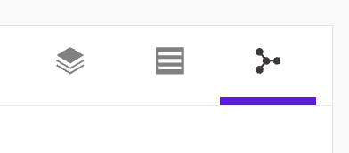

## SCENARIO / CONTEXT
In Section 1.1 we began to form an understanding of the broader environment. We learned the types of devices on the network, how they're connected, and formed a high-level overview of the network (such as subnets). 

To dig a little deeper, we want to begin understanding the specific devices on the network, how they interact, and contextualize their role in the network. Additionally we want to begin forming an understanding of the network topology through both the classic Purdue model and OSI model.

There may also be gaps in the asset inventory data. This could be due to the differences in passive versus active scanning, or missing network telemetry. We want to begin forming an understanding of what gaps exist, and form a generalized process to find the missing data.

---
## TASK 1: Environment Familiarization
1. Navigate to `Visibility` > `Assets`.  
2. Switch from `List View` to `Network Topology View` (top right of **Results (#)** table). Much like for zones, the **Network Topology View** shows the communication lines between assets. 
The icon is shown in the image below, with the purple underline:

   * Are there any assets that stand out in terms of communication lines, and what sort of assets are they? To view this information, right click on the asset and an informational popup will appear.
  
3. Return to `List View` and select the **kebab menu** (``⋮``) located in the top-left corner of the **Results** table.
  
4. Click on ``Select Columns`` The pop up menu will display every available column option. 
   1. Remove the ``First Seen`` and ``Last Seen`` columns
   1. Add the ``Firmware`` and ``Model`` columns.
  
4. Sort the assets by ``Model``
   - Not every asset has information regarding its model number. Some asset information is inaccessible through passive scanning and requires an active query, such as firmware, serial numbers, etc.

### TASK 1 REFLECTION
* What are possible causes of why some devices have model, firmware, and serial numbers, but others do not?
* In what situation would viewing the environment through ``Network Topology View`` be helpful? What are its limitations?

---
## TASK 2: Asset Details
* Search for an asset named "Chemical_plant" and click on the name.
  
* The **Asset Overview** page display summarized information
  
* Go to the `Device Information` tab. This page provides information, such as the asset's IP address, Purdue Level, and Vendor.
   * What information can we expect from an actively queried device, versus a passive collection?
   * For the ``Chemical_plant`` device, what kind of device is it?
   * Are there nested devices? What can we discover about them?
  
* Go to `Risks & Vulnerabiltiies`. The page displays a web graph of the asset's risk level, a list of vulnerabilities, any insights, and a summary of the asset's risk score.

| title | description |
|:-|:-|
| Vulnerability | A vulnerability is any facet of an asset that could potentially be taken advantage of. However, just because a vulnerability exists, does not necessarily mean it is relevant to the device.  In the **Vulnerabilities** table, sort by *Confirmed*. |
| Threat | A threat score is calculated with *Indicators of Activity* (IoA) and *Indicators of Compromise* (IoC). |
| Criticality | An asset's criticality rating is determined by the importance an asset, and by what the cascading effects of its compromise might be. | 
| Accessbility | An asset's accessbility is related to its zone and location on the network in relation to other devices, and how a threat actor might be able to utilize lateral movement if they are able to compromise the asset. |
| Infection | The likelihood that the asset could already be affected by, exposed to, or contribute to the spread of malicious activity based on its communications, protocols, relationships, alerts, and surrounding network context. |

### TASK 2 REFLECTION
* Given the information provided about the vulnerabilities, how would you contextualize 

* Go to `Threat Detection`. 
* Go to `Network Analytics`.
   - The **Network Communication Map** can be used to see the typical protocols used by the device, allowing abnormal communications to be spotted more easily. It can also be used to determine if incongruent protocols, like BACNET & GOOSE, are being used simultaneously.
* Go to `Communication`. It displays **Policies** (defined communication paths between zones), **Baselines** (typical recorded communications), etc. 
   - This page can be used to determine if there is traffic between zones that shouldn't exist, or if there are unordinary packet communications.
   
### TASK 2  REFLECTION
- How can risk score components help prioritize investigations?
- How can communication patterns and baselines help identify abnormal behavior?